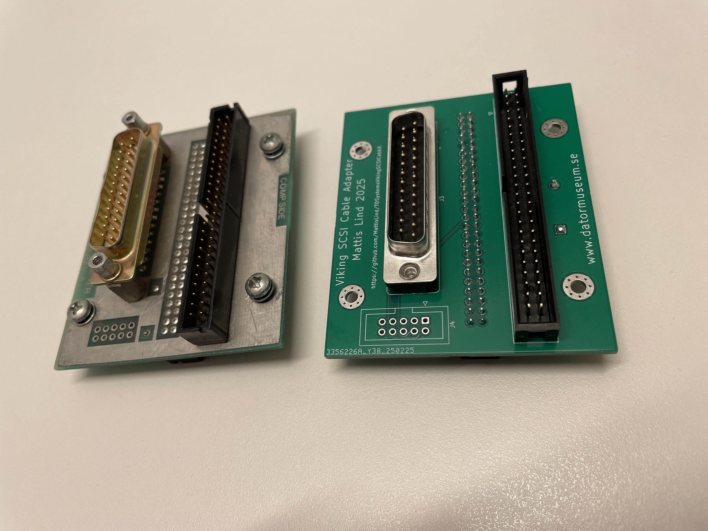
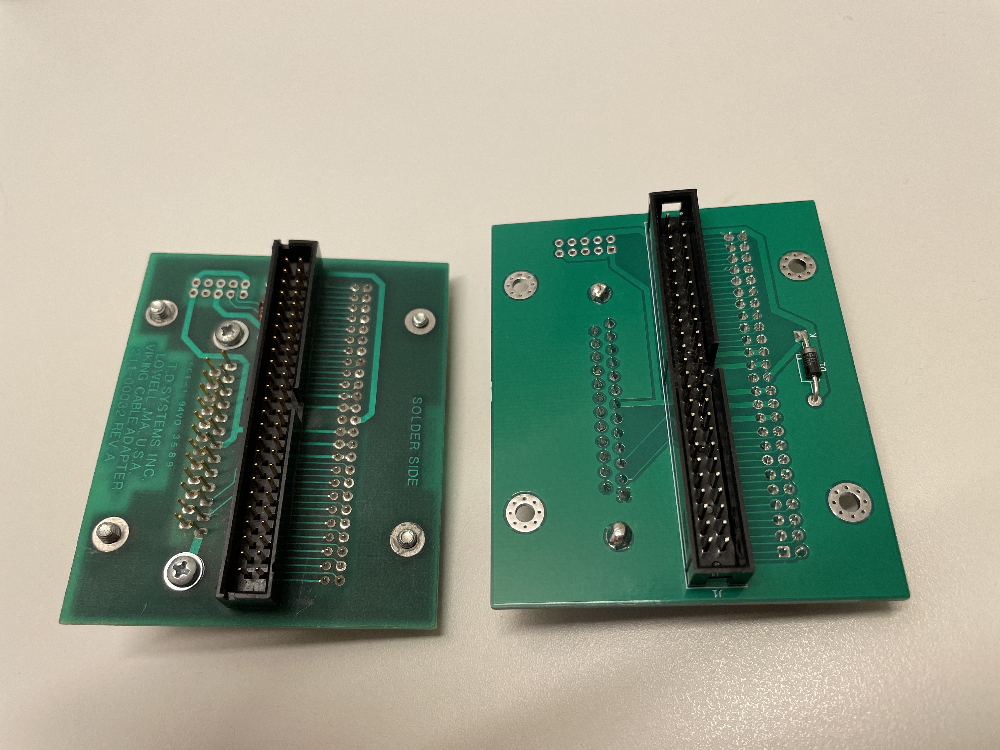

# Adapter board for Viking SCSI cards

This is an adapter board for the TD Systems line of Viking SCSI cards for DEC Qbus and Unibus.
It is an replica of the original by TD Systems.

| Component designator | Commponent | Manufacturer | Manufacturer ID |
|----------------------|------------|--------------|-----------------|
|      J1              | 50 pin shrouded header | ADAM TECH | [BHR-50-VUA](https://www.mouser.se/ProductDetail/737-BHR-50-VUA)  |
|      J2              | 50 pin shrouded header | ADAM TECH | [BHR-50-VUA](https://www.mouser.se/ProductDetail/737-BHR-50-VUA)  |
|      J3              | Male 25 pin DSUB solder to PCB | Amphenol | [L717TSBH25POL2RM5](https://www.mouser.se/ProductDetail/523-717TSBH25POL2RM5) |
|      J4              | Unpopulated |      |      |
|      D1              | Schottky Diode 2A 100V DO-41 | ST | [STPS2H100](https://www.mouser.se/ProductDetail/511-STPS2H100) |
